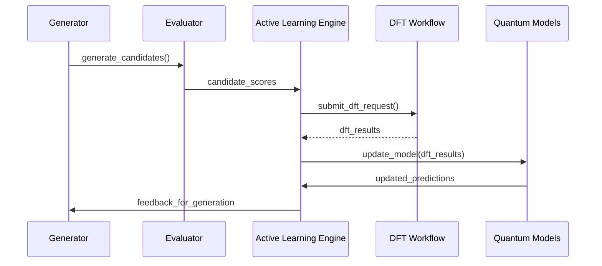

```mermaid
sequenceDiagram
    participant Gen as Generator
    participant Eval as Evaluator
    participant AL as Active Learning Engine
    participant DFT as DFT Workflow
    participant Model as Quantum Models

    Gen->>Eval: generate_candidates()
    Eval->>AL: candidate_scores
    AL->>DFT: submit_dft_request()
    DFT-->>AL: dft_results
    AL->>Model: update_model(dft_results)
    Model->>AL: updated_predictions
    AL->>Gen: feedback_for_generation
```
